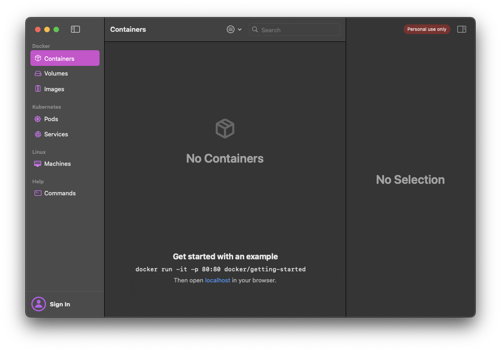

# Orb Stack

## 설명
윈도우의 wsl처럼 사용이 가능한 macos용 프로그램입니다.

## 설치 영역
`/Applications/OrbStack.app`

## 사용처
- 윈도우의 wsl같이 리눅스 배포판을 맥에서 사용 가능하게 해주는 프로그램
- 도커 사용 가능
- x86_64 컨테이너 에뮬레이션 가능

## 설치(접속) 방법
### homebrew로 설치하는 경우
1. **Orb Stack 설치:**
   - 터미널에 다음 명령어를 입력하여 설치합니다. 
   ```bash
   brew install --cask orbstack
   ```
2. **Orb Stack 실행:**
   - 터미널에 다음 명령어를 입력하여 실행합니다. 
   ```bash
   orb
   ```

### 설치 프로그램 다운
1. **Orb Stack 다운로드 및 설치:**
   - [Orb Stack 다운로드 웹사이트](https://orbstack.dev/download)에서 설치 파일을 다운로드 합니다.
   - 설치 파일을 실행하고 화면 지시에 따라 설치를 완료합니다.
   
2. **Orb Stack 실행:**
   - 어플리케이션 폴더에서 `Orb Stack`을 실행합니다.

## 접속 화면


## 주의 사항
- 개인적인(비상업적) 용도의 경우 무료로 사용이 가능합니다.

## 관련 URL
[Orb Stack 공식 웹사이트](https://orbstack.dev/)  