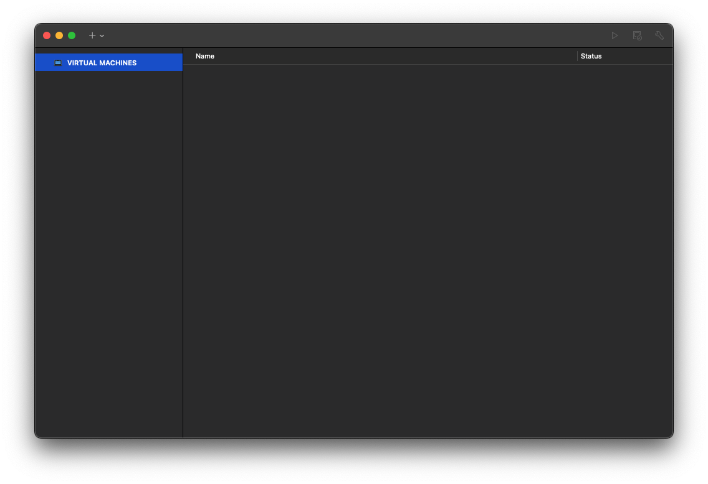

# VMware Workstation Player

## 설명
VMware Workstation Player는 Windows 또는 Linux PC에서 단일 가상 머신(VM)을 실행할 수 있도록 해주는 데스크톱 가상화 애플리케이션입니다.  

## 설치 영역
`/Applications/VMware Fusion.app`

## 사용처
- **새로운 운영 체제 테스트:**  
- **레거시 애플리케이션 실행:**  
- **보안 테스트:**  
- **교육 및 학습:**  

## 설치(접속) 방법
1. **VMware Workstation Player 다운로드:**  VMware 웹사이트([https://support.broadcom.com/group/ecx/productdownloads?subfamily=VMware+Workstation+Pro](https://support.broadcom.com/group/ecx/productdownloads?subfamily=VMware+Workstation+Pro))에서 MAC용 설치 파일을 다운로드합니다.
2. **설치 파일 실행:**  다운로드한 파일을 실행하고, 화면의 지시에 따라 설치를 진행합니다.  
3. **VMware Workstation Player 실행:**  설치가 완료되면 시작 메뉴 또는 바탕 화면에서 VMware Workstation Player를 실행합니다.
4. **가상 머신 생성 또는 열기:**  새 가상 머신을 만들거나, 기존에 생성된 가상 머신 파일을 열어 사용합니다.  가상 머신 생성 시에는 운영 체제 ISO 이미지 파일이 필요합니다.

## 설치(접속) 확인
VMware를 실행한 후, 가상 머신을 생성하여 운영 체제가 정상적으로 부팅되는지 확인하세요.

## 주의 사항
- VMware Fusion은 유료 소프트웨어이며, 개인 사용자(비상업적 용도)에 한해 무료로 사용이 가능합니다.
- macOS에서 가상 머신을 실행하려면 Virtualization이 활성화되어 있어야 합니다.

## 관련 URL
[VMware Fusion 공식 웹사이트](https://www.vmware.com/products/fusion.html)
