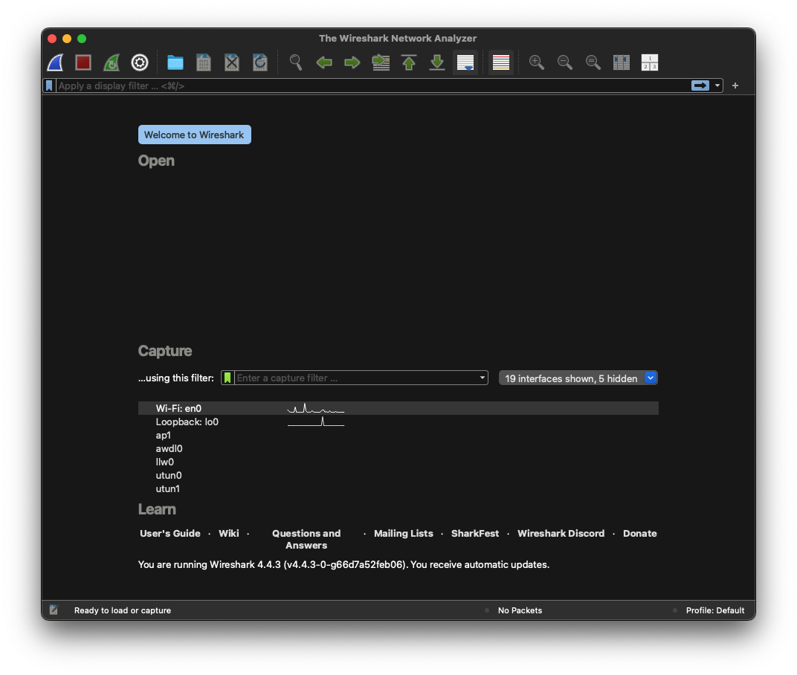

# Wireshark

## 설명
네트워크 트래픽을 캡처하고 패킷 데이터를 분석할 수 있는 도구.

## 설치 영역
`/Applications/Wireshark.app`

## 사용처
- 네트워크 문제 해결
- 데이터 트래픽 분석
- 보안 점검

## 설치(접속) 방법
1. **Homebrew를 통해 설치:**
   ```bash
   brew install --cask wireshark
   ```
2. **설치 확인:**
   ```bash
   open -a wireshark
   ```

## 접속 화면


## 주의 사항
- macOS에서는 네트워크 인터페이스 접근 제한이 있을 수 있으므로, 아래 명령으로 권한을 부여해야 합니다:
   ```bash
   sudo chown (사용자이름) /dev/bpf*
   ```

## 관련 URL
[Wireshark 공식 웹사이트](https://www.wireshark.org/)
