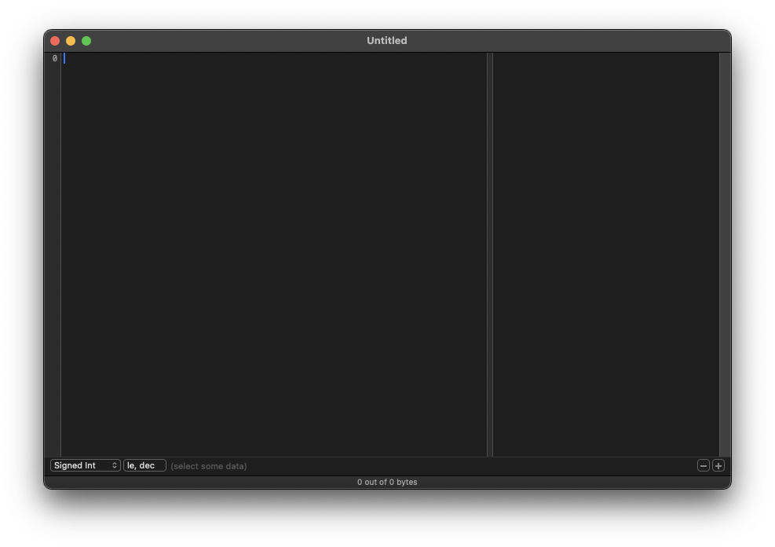

# hex Fiend

## 설명
macOS 전용 오픈소스 hex editor

## 설치 영역
`/Applications/hex Fiend.app`

## 사용처
- Hex edit
- Binary diff

## 설치(접속) 방법
### App Store 이용하는 방법
1. **hex Fiend 설치**
   - App Store에서 hex Fiend를 검색하고 설치를 누르면 됩니다.

### homebrew 이용하는 방법
1. 터미널에 다음 명령어를 입력합니다.
```bash
brew install --cask hex-fiend
```

### github 이용하는 방법
1. [hex Fiend github](https://github.com/HexFiend/HexFiend)의 Releases 페이지에서 원하는 버전을 다운 받습니다.
2. .dmg 파일을 실행하여 설치를 진행합니다.

### 설치 확인
애플리케이션 폴더에서 hex Fiend를 실행

터미널에 다음 명령어를 입력하여 사용 방법 확인

```bash
hexf -h
```

출력 예시
```
USAGE: hexf [--diff] [<file> ...]

ARGUMENTS:
  <file>                  Files to open.
        If no input files are provided, hexf reads from stdin.

OPTIONS:
  -d, --diff              Compare two files.
  --version               Show the version.
  -h, --help              Show help information.
```

## 접속 화면


## 주의 사항
- github에서 pre-release 버전을 다운 받은 경우 프로그램이 불안정할 수 있습니다.

## 관련 URL
[hex Fiend 공식 웹사이트](https://hexfiend.com/)