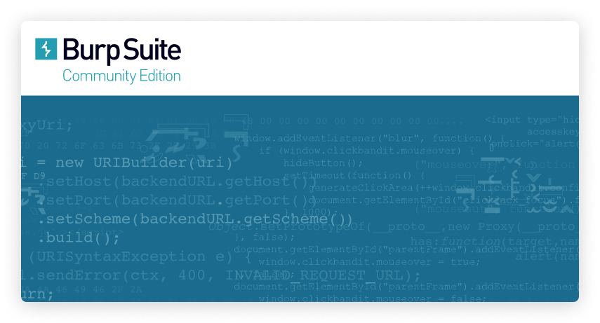

# Burp Suite

## 설명
웹 애플리케이션 보안 테스트 도구로, 트래픽 분석과 취약점 점검을 지원합니다.

## 설치 영역
`/Applications/Burp Suite.app`

## 사용처
- 웹 애플리케이션 보안 점검
- 네트워크 트래픽 가로채기 및 분석
- 취약점 테스트 (SQL Injection, XSS 등)

## 설치(접속) 방법
1. **공식 웹사이트에서 다운로드하여 설치.**
   [Burp Suite 공식 웹사이트](https://portswigger.net/burp)

2. **homebrew를 이용하여 설치**
   - 아래 명령어를 이용하여 설치
   ```bash
   brew install burp-bsuite
   ```
## 접속 화면


## 주의 사항
- Burp Suite는 일부 기능이 유료로 제공됩니다.
- 네트워크 가로채기 설정 시 SSL 인증서 설정이 필요할 수 있습니다.
