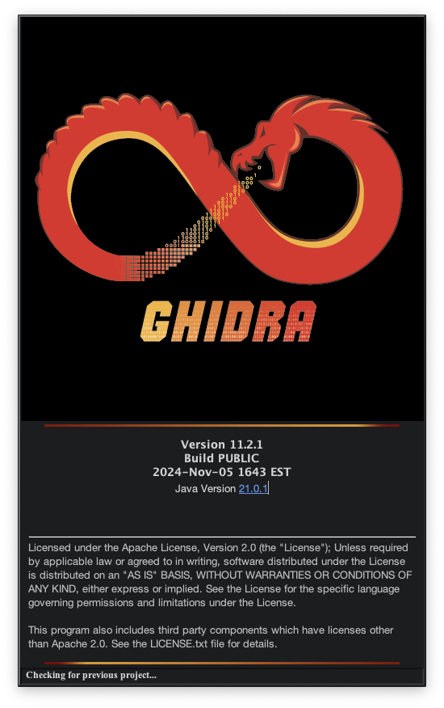

# Ghidra

## 설명
미국 NSA에서 제작한 오픈소스 소프트웨어 리버스 엔지니어링 도구

## 설치 영역
### homebrew로 설치한 경우
`/opt/homebrew/Caskroom/ghidra/{version}/ghidra_{version}_PUBLIC/ghidraRun`

### ghithub에서 다운받은 경우
`/Users/{user}/Desktop/ghidra_{version}_PUBLIC/ghidraRun`

## 사용처
- 바이너리 디컴파일, 디버깅
- 바이너리 에뮬레이션 (syscall 제외)
- 바이너리 디핑

## 설치(접속) 방법
### homebrew로 설치한 경우
1. **Ghidra 설치 방법**
   - 터미널에 다음 명령어를 입력하여 설치합니다. `brew install --cask ghidra`
2. **Ghidra 실행 방법**
   - 터미널에 다음 명령어를 입력하여 실행합니다. `ghidraRun`

### 압축파일 다운로드 한 경우
1. **파일 압축 해제**
   - 압축 해제한 폴더 열기
2. **실행 파일 실행**
   - ghidraRun 실행

## 접속 화면

## 주의 사항
- 확장 없이 ghidra로 파이썬 스크립트를 작성하기 위해선 기존 CPython 문법이 아닌 Jython으로 작성해야 합니다.
- Homebrew로 설치한 경우 다음 명령어를 통해서 새로운 버전이 나온 경우 업그레이드 가능 `brew outdated && brew upgrade`

## 관련 URL
[Ghidra 공식 웹사이트](https://ghidra-sre.org)  
[리버싱 입문자를 위한 Ghidra 튜토리얼](https://blog.hspace.io/posts/Ghidra-tutorial-for-reversing-beginners/)